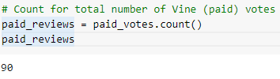
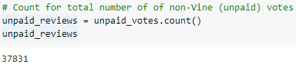
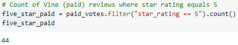
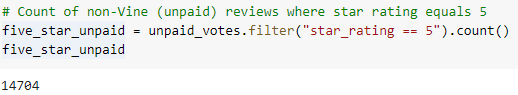
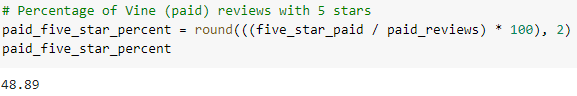
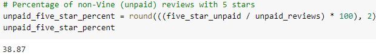

# Amazon_Vine_Analysis
## Project Overview
The purpose of this project is to analyze Amazon reviews written by members of the paid Vine program by creating an ETL pipeline. After obtaining my dataset, I stored it in an Amazon S3 bucket and then used Python PySpark to extract/transform the data, connected to an AWS RDS instance, and loaded the transformed data into a pgAdmin SQL database. I then used PySpark to analyze the data to determine if any bias existed towards favorable reviews from Vine members.

## Project Results
- There were 90 Vine reviews and 37,831 none-Vine reviews.

- There were 44 5-star Vine reviews and 14,704 5-star non-Vine reviews.

- 48.89% of Vine reviews contained 5-stars and 38.87% of non-Vine reviews contained 5-star reviews.

## Project Summary
- The Vine member reviews had an approximately 10% higher percentage of 5-star reviews than non-Vibe members, indicating a possible positivity bias.
- One additional analysis I would do to determine positivity bias based on Vine membership would be to group each star number review by count and then graph it in order to look for trends at the other star review levels.
